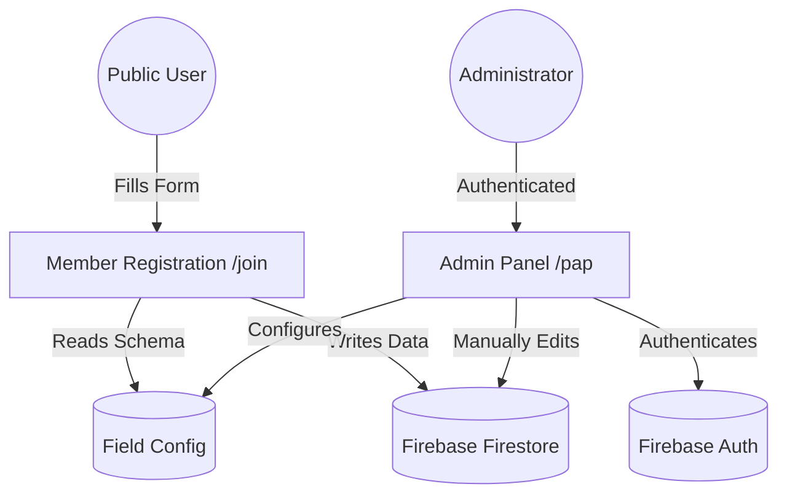
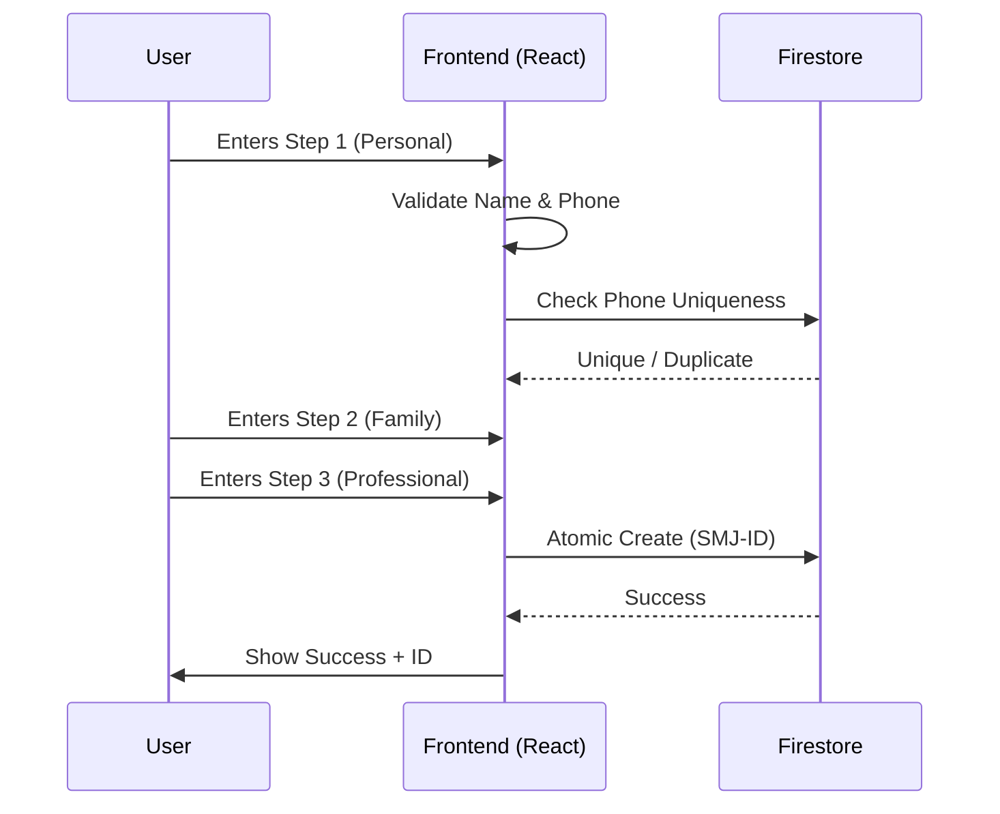
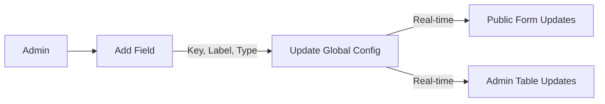

<p align="center">
  
</p>

# 📄 Shri Lalabapa Seva Samiti – Member Information System
## (શ્રી લાલાબાપા સેવા સમિતિ – સભ્ય માહિતી સિસ્ટમ)

> [!IMPORTANT]
> **Trust Details**
> - **Trust Registration No:** A/5366/Ahmedabad
> - **Location:** વાડજ, અમદાવાદ (Vadaj, Ahmedabad)
> - **Purpose:** Dedicated to community service and member welfare.

A private, secure, and dynamic member management platform for the **Shri Lalabapa Seva Samiti** community.

---

## 🚀 Overview

This application serves as an administrative backbone for managing community member data. It features a public-facing registration form and a robust, protected administrative panel for data analysis, field configuration, and member management.

### Key Characteristics
- **Privacy First**: No public member directory; data is only accessible to authorized administrators.
- **Dynamic Architecture**: Form fields can be added, removed, or reordered by admins without code changes.
- **Gujarati-First UI**: Optimized for the community with native language support.
- **Cloud Native**: Built with a modern serverless stack for high availability and low cost.

## 🏗️ Architecture



---

## ✨ Features

### 📝 Public Form (`/join`)
- **Multi-Step Flow**: A user-friendly 3-step process to collect Personal, Family, and Professional information.
- **Real-time Validation**: Instant feedback on required fields and 10-digit phone number validation.
- **Duplicate Prevention**: Automatically checks for existing phone numbers to prevent double entries.

#### 🔄 Registration Flow


### 🔐 Admin Dashboard (`/pap`)
- **Real-time Analytics**: Quick view of total members, today's entries, and important records.
- **Advanced Filtering**: Filter data by date range, tags, status, area, and profession.
- **Recent Activity Feed**: Audit trail of all administrative actions (creates, edits, hiddens).

### 👥 Member Management
- **Dynamic Table**: Lists members with customizable columns based on active fields.
- **Detailed View**: Deep-dive into member profiles including edit history and internal notes.
- **Communication Tools**: One-click WhatsApp integration for direct member outreach.
- **Data Portability**: Powerful Excel export for offline reporting and analysis.

### 🧩 Field Manager
- **Zero-Code Configuration**: Admins can manage the data schema directly from the UI.
- **Multiple Field Types**: Supports text, number, dropdown, and date inputs.
- **Status Control**: Soft-delete or hide fields while preserving historical data.

#### ⚙️ Configuration Workflow


---

## 🛠️ Tech Stack

### Frontend


### Backend & Infrastructure


### Utilities


---

## ⛑️ Getting Started

### Prerequisites
- Node.js (v18+)
- npm or yarn
- Firebase Project

### Installation

1. **Clone the repository:**
   ```bash
   git clone <repository-url>
   cd lalabapa
   ```

2. **Install dependencies:**
   ```bash
   npm install
   ```

3. **Environment Setup:**
   Create a `.env` file in the root directory and add your Firebase configuration:
   ```env
   VITE_FIREBASE_API_KEY=your_api_key
   VITE_FIREBASE_AUTH_DOMAIN=your_auth_domain
   VITE_FIREBASE_PROJECT_ID=your_project_id
   VITE_FIREBASE_STORAGE_BUCKET=your_storage_bucket
   VITE_FIREBASE_MESSAGING_SENDER_ID=your_sender_id
   VITE_FIREBASE_APP_ID=your_app_id
   ```

4. **Run Development Server:**
   ```bash
   npm run dev
   ```

---

## 📦 Available Scripts

- `npm run dev` - Start development server with HMR.
- `npm run build` - Build the production bundle.
- `npm run lint` - Run ESLint to check for code quality issues.
- `npm run preview` - Locally preview the production build.

---

## 🔒 Security & Roles

- **Public**: Access to Landing Page and Member Registration only.
- **Admin**: Full access to the Dashboard, Member List, and Field Configuration.
- **Database Rules**: Firestore security rules ensure that only authenticated admins with specific email addresses can read/write data.

---

## 📄 License

Owned By **Poojan Chauhan** ([poojanchauhan.in](https://poojanchauhan.in))
All rights reserved.
